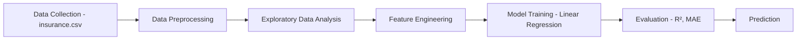
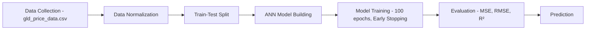
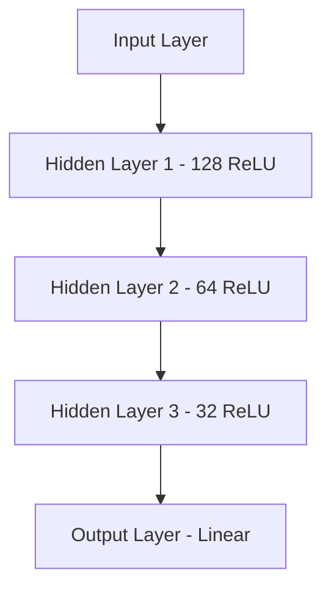
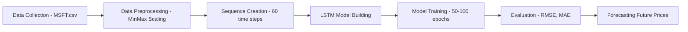
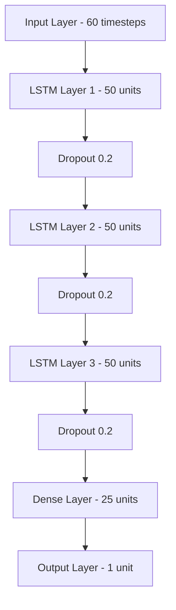
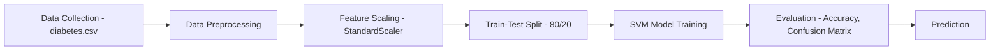
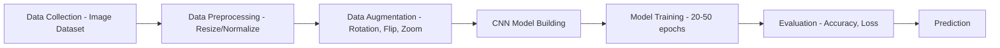
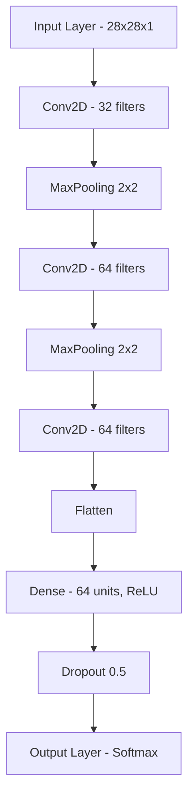

# 📊🧠 Data Science Projects

This repository contains multiple Data Science and Machine Learning projects demonstrating predictive modeling, deep learning, and AI techniques.

## 📋 Table of Contents
- Projects Overview
- Project Structure
- Tech Stack
- Setup Instructions
- Detailed Project Documentation
- Results & Visualizations
- Future Enhancements

---

## 🚀 Projects Overview

- Medical Insurance Cost Prediction using Linear Regression 🏥💰  
- Gold Price Prediction using Artificial Neural Network (ANN) 🪙📈  
- Stock Price Prediction using LSTM 📉📊  
- Diabetes Prediction using Support Vector Machine (SVM) 🧪🩺  
- Implementation of CNN using Keras & TensorFlow 🖼️🤖  

---

## 📂 Project Structure

```
DataScience-Projects/
│
├── Medical_Insurance_LinearRegression.ipynb
├── GoldPrice_ANN.ipynb
├── StockPrice_LSTM.ipynb
├── Diabetes_SVM.ipynb
├── CNN_ImageClassification.ipynb
│
├── datasets/
│   ├── insurance.csv
│   ├── gld_price_data.csv
│   ├── MSFT.csv
│   ├── diabetes.csv
│   └── ...
│
├── models/
│   ├── insurance_model.pkl
│   ├── gold_price_ann.h5
│   ├── stock_lstm.h5
│   ├── diabetes_svm.pkl
│   └── cnn_model.h5
│
├── requirements.txt
├── README.md
└── images/
    ├── workflow_diagrams/
    └── results/
```

---

## ⚙️ Tech Stack

**Programming Language:** Python 🐍  

**Libraries & Frameworks:**  
- NumPy, Pandas, Matplotlib, Seaborn  
- Scikit-learn  
- TensorFlow, Keras  
- Jupyter Notebook  

---

## 🛠️ Setup Instructions

**Clone the repository:**

```bash
git clone https://github.com/yourusername/DataScience-Projects.git
cd DataScience-Projects
```

**Install dependencies:**

```bash
pip install -r requirements.txt
```

**Run Jupyter Notebook:**

```bash
jupyter notebook
```

Open any project notebook and execute step by step.

---

## 📊 Detailed Project Documentation

### 1️⃣ Medical Insurance Cost Prediction using Linear Regression 🏥💰

📌 **Description**  
Predicts medical insurance costs based on factors such as age, gender, BMI, number of children, smoking habits, and region.

🔍 **Workflow Diagram**  

[Data Collection] → [Data Preprocessing] → [EDA] → [Feature Engineering] → [Model Training] → [Evaluation] → [Prediction]
     ↓                  ↓                    ↓          ↓                  ↓              ↓           ↓
 insurance.csv    Handling missing     Correlation   One-hot encoding   Linear        R² Score    Cost
                  values, encoding     analysis                       Regression     MAE        Prediction

## ⚙️ Features
- Dataset: insurance.csv
- Exploratory Data Analysis (EDA) on features affecting cost
- Model: Linear Regression
- Performance metrics: R² score, Mean Absolute Error (MAE)

## 🔍 Working
- Load and preprocess the dataset
- Perform EDA and visualize correlations
- Train a Linear Regression model
- Evaluate performance using metrics
- Make predictions on new data

## 📊 Key Visualizations
- Correlation heatmap
- Feature importance plot
- Actual vs Predicted cost scatter plot
- Residual analysis plot
---

### 2️⃣ Gold Price Prediction using Artificial Neural Network (ANN) 🪙📈

📌 **Description**  
Predicts the gold price using deep learning with an Artificial Neural Network.

🔍 **Workflow Diagram**  
[Data Collection] → [Data Normalization] → [Train-Test Split] → [ANN Model Building] → [Model Training] → [Evaluation] → [Prediction]
     ↓                    ↓                     ↓                   ↓                   ↓              ↓           ↓
 gld_price_data.csv   MinMaxScaler          80-20 split        Input Layer →       100 epochs     MSE, RMSE,   Gold Price
                                        Hidden Layers →      Early Stopping         R² Score    Prediction
                                        Output Layer




🏗️ **ANN Architecture**  



## ⚙️ Features
- Dataset: gld_price_data.csv
- Model: ANN (Dense Neural Network)
- Libraries: TensorFlow, Keras
- Evaluation: MSE, RMSE, R² score

## 🔍 Working
- Load and normalize the dataset
- Split into training and testing sets
- Train an ANN model using Keras
- Evaluate prediction accuracy
- Visualize predictions vs actual prices


---

### 3️⃣ Stock Price Prediction using LSTM 📉📊

📌 **Description**  
Forecasts future stock prices using Long Short-Term Memory (LSTM).

🔍 **Workflow Diagram**  
[Data Collection] → [Data Preprocessing] → [Sequence Creation] → [LSTM Model Building] → [Model Training] → [Evaluation] → [Forecasting]
     ↓                    ↓                     ↓                   ↓                   ↓              ↓           ↓
   MSFT.csv          MinMax Scaling        Time-step sequences  LSTM layers        50-100 epochs   RMSE, MAE   Future Price
                    (0 to 1)              (60 time steps)      Dropout layers     Early Stopping              Prediction




🏗️ **LSTM Architecture**  


## ⚙️ Features
- Dataset: MSFT.csv (Microsoft stock prices)
- Model: LSTM (RNN)
- Data preprocessing: MinMax scaling, sequence generation
- Libraries: TensorFlow, Keras

## 🔍 Working
- Preprocess stock price data
- Create time-step sequences for LSTM input
- Train an LSTM model on stock price data
- Visualize predictions vs actual prices
- Make future price predictions

---

### 4️⃣ Diabetes Prediction using Support Vector Machine (SVM) 🧪🩺

📌 **Description**  
Predicts whether a patient has diabetes based on health parameters.

🔍 **Workflow Diagram**  
[Data Collection] → [Data Preprocessing] → [Feature Scaling] → [Train-Test Split] → [SVM Model Training] → [Evaluation] → [Prediction]
     ↓                    ↓                     ↓                   ↓                   ↓              ↓           ↓
 diabetes.csv        Handle missing        StandardScaler       80-20 split        SVM Classifier   Accuracy,   Diabetes
                     values, outliers                                        (Linear/RBF kernel)  Confusion   Diagnosis
                                                                                    Matrix


⚙️ Features
- Dataset: diabetes.csv
- Model: Support Vector Machine (SVM)
- Libraries: scikit-learn, pandas, matplotlib
- Evaluation: Accuracy score, confusion matrix, classification report

🔍 Working
- Load dataset and preprocess features
- Train an SVM classifier
- Evaluate performance using accuracy and confusion matrix
- Predict outcome for new patient data
- Perform cross-validation

## 📋 Features Used
- Glucose level
- Blood pressure
- Skin thickness
- Insulin
- BMI
- Diabetes pedigree function
- Age


---

### 5️⃣ Implementation of CNN using Keras & TensorFlow 🖼️🤖

📌 **Description**  
Implementation using Convolutional Neural Networks.

🔍 **Workflow Diagram**  
[Data Collection] → [Data Preprocessing] → [Data Augmentation] → [CNN Model Building] → [Model Training] → [Evaluation] → [Prediction]
     ↓                    ↓                     ↓                   ↓                   ↓              ↓           ↓
 Image Dataset       Resize, Normalize     Rotation, Zoom,      Conv2D → MaxPooling   20-50 epochs   Accuracy,   Image
 (MNIST/CIFAR-10)   (0-255 to 0-1)        Flip, Shift          Flatten → Dense        Callbacks      Loss        Classification


🏗️ **CNN Architecture**  


## ⚙️ Features
  - Model: CNN architecture with Conv2D, MaxPooling, Flatten, Dense layers
  - Frameworks: TensorFlow & Keras
  - Dataset: Any image dataset (e.g., MNIST, CIFAR-10)

## 🔍 Working
 - Load dataset (image data)
 - Build CNN model using Keras layers
 - Train CNN model with backpropagation
 - Evaluate accuracy and visualize results
 - Make predictions on new images

---

## 📊 Results & Visualizations

- **Linear Regression:** Insurance cost vs actual cost plots, residual analysis, correlation matrix  
- **ANN:** Gold price prediction graphs, training/validation loss curves ,Prediction error distribution
- **LSTM:** Stock price forecasting visualizations, loss curve ,Predicted vs Actual stock price chart,Multi-step forecasting visualization,Model loss during training
- **SVM:** Confusion matrix heatmap, ROC curve and AUC score,Feature importance analysis
- **CNN:** Accuracy & loss curves, sample predictions ,Training/validation accuracy & loss curves,Sample predictions with confidence scores,Feature maps visualization

---

## 🚀 Future Enhancements / 🔧 Technical Improvements

- Hyperparameter tuning (GridSearchCV, RandomizedSearch)  
- Cross-validation across models  
- Ensemble methods  
- Automated ML pipelines  

**Deployment Ideas:**  
- Flask / Streamlit apps  
- REST APIs  
- Interactive dashboards  
- Mobile app integration  

**Data Sources:**  
- Real-time APIs for stock & gold prices  
- Live medical datasets  
- Diverse image datasets  

**Advanced Features:**  
- Model interpretability (SHAP/LIME)  
- Automated model monitoring  
- A/B testing framework  
- Performance tracking  

---

## 📞 Contact & Support  

For questions, suggestions, or contributions, please create an issue in the repository.  

✨ This repository is a collection of end-to-end Data Science and Machine Learning projects demonstrating regression, classification, time-series forecasting, and deep learning techniques.
